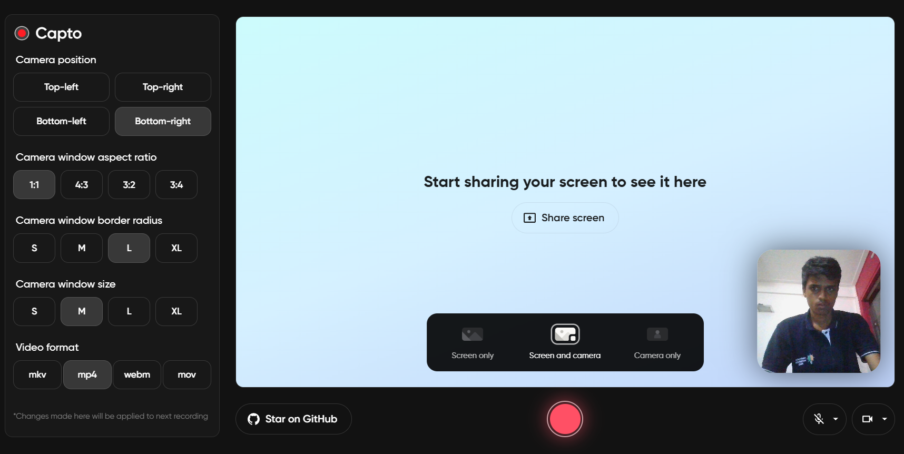

# 🎥 Capto

Welcome to Capto, the coolest open-source web application that lets you capture your screen and camera right in your browser! No downloads or installations needed – just head over to [capto.vercel.app](https://capto.vercel.app/), and start your recording! 🚀

<a align="center" href="https://capto.vercel.app/">
  
  
</a>

&nbsp;

## Features

- ✨ **Simple and Intuitive:** Designed for simplicity, this recorder ensures effortless recording for users of all experience levels.
- 🎥 **Screen and Camera Recording:** Record your browser tab or window while seamlessly integrating your webcam for a personal touch.
- 🖼️ **Picture-in-Picture View:** Enjoy the convenience of a picture-in-picture view, letting you see yourself while recording your screen.
- 🔒 **Local and Secure:** Privacy should always be a top priority! All recordings take place directly in your browser so whatever you record, only you’ll have access to it.
- 🎬 **Real-time Preview:** Preview your camera and screen recording in real-time before diving into the action.
- ⚙️ **Customizable Configuration:** Choose where your camera window appears on the screen, adjust its size, and select the desired aspect ratio to suit your style.
- 📁 **Multiple Format Support:** Save your recordings in various formats, including MP4, WebM, and MKV, for maximum compatibility and convenience.


## How to Use

1. **Access the Web Application:** Fire up your Google Chrome browser and head to [capto.vercel.app](https://capto.vercel.app/).

2. **Choose Your Mode:** Select your desired recording mode:

   - 🖥️ **Screen only:** Capture your browser tab or window without the camera.
   - 🎥 **Screen and camera:** Record your browser tab or window along with your awesome camera.
   - 📷 **Camera only:** Focus solely on your camera for a personal touch.

3. **Start Recording:** Click the big red "Record" button to kickstart your screen and camera recording adventure.

4. **Picture-in-Picture View:** Your camera will appear in a nifty picture-in-picture view while recording the screen.

5. **Save and Share:** Ready to wrap it up? Click the "Stop" button and save your masterpiece as a video file to share with the world! 🌎

## Browser Compatibility

Recorder only works with **Google Chrome**! It leverages certain browser capabilities that may not be available in other browsers at the moment.

## Support

If you encounter any issues, have questions, or need assistance, please feel free to [open an issue](https://github.com/vaibhav1663/capto/issues) on GitHub. We welcome your feedback and are happy to assist with any questions or concerns you may have.

## Development & Contributions

Excited to dive into the code and make this app even cooler? To get started, follow these steps:

1. **Clone the Repository:** Fork the Recorder repository and clone it to your local machine using Git.

   ```bash
   git clone https://github.com/vaibhav1663/capto.git
   ```

2. **Navigate to the Directory:** Move into the Recorder project directory.

   ```bash
   cd recorder
   ```

3. **Install Dependencies:** Install the necessary dependencies using Yarn.

   ```bash
   yarn
   ```

4. **Run the Development Server:** Start the development server with Yarn.

   ```bash
   yarn dev
   ```

5. **Make Your Changes:** Work your magic! Make the desired improvements, add features, or fix issues.

6. **Create a Pull Request:** Once you're happy with your changes, create a pull request on the main Recorder repository. We'll review your contribution and merge it if everything looks good!

<br/>

Time to unleash your creativity and capture those moments with Recorder! 🎬🌟 Lights, camera, action!
